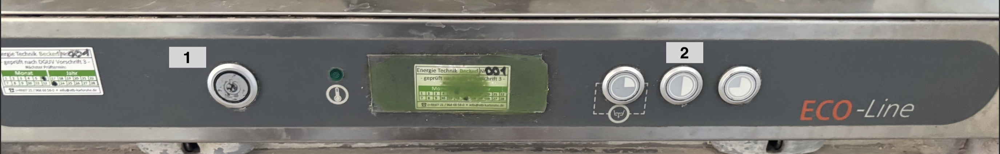
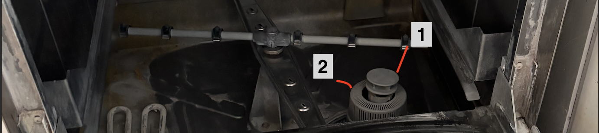

# Spülmaschine

* Einschalten
  * Knopf 1 kurz gedrückt halten, bis Maschine läuft
  * Sieb und Stopfen einsetzen
  * Klappe zumachen
  * es empfiehlt sich, die Maschine 1-2 mal laufen zu lassen, so dass diese sich aufwärmt und Spülmittel zieht
* Laufen lassen
  * Knopf 2 ganz links kurz gedrückt halten, bis Maschine läuft
  * die Spülleistung ist nicht besonders groß, daher empfiehlt es sich, Teller und Besteck vorab zu säubern, ansonsten bleiben die Reste in der Spülmaschine und man muss diese sauber machen

* Ausschalten
  * Klappe aufmachen
  * Stopfen (1) rausnehmen
  * alle 3 Knöpfe rechts gleichzeitig drücken, bis ein Abpump-Geräusch zu hören ist
  * Sieb (2) durch Drehen rausnehmen und sauber machen
  * Innenraum auswischen
  * Knopf 1 drücken
  * Sieb und Stopfen können in die Maschine gelegt werden
  * Maschine ist nun aus, die Klappe bitte offen lassen (ansonsten müftelt es)
